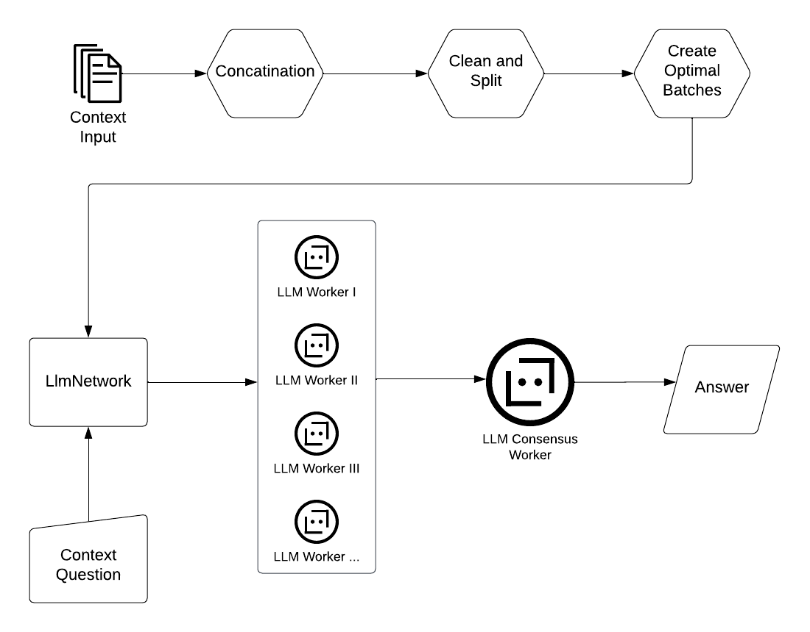

# Llmnet

This repo is inspired by the work: "Lost in the Middle: How Language Models Use Long Contexts" written by Nelson F. Liu, Kevin Lin, John Hewitt, Ashwin Paranjape, Michele Bevilacqua, Fabio Petroni, Percy Liang.

## Llmnet Objective

Llmnet aims to address the challenges of "Lost in the Middle: How Language Models Use Long Contexts" scenarios in multi-document question answering tasks through a divide and conquer approach. Llmnet specifically focuses on the phenomenon of decreasing performance when large language models are provided with input context sequences longer than the training context window sizes. To achieve this, Llmnet divides the input context into batches that align with the training-time context window size of the LLM being used. For each batch, Llmnet creates separate LLM workers in parallel. These LLM workers receive the same question and provide answers based on their assigned input context batch. Finally, the answers from all the LLM workers are collected and sent to a final consensus worker, whose role is to synthesize the information and provide an answer to the question.

## Llmnet Architecture

<br>

<p align="center">
  
</p>

## Example

### Prerequisite  

The user needs to supply all documents as one concatenated string. Llmnet does not focus on preprocessing at this point in time and only provides minimal preprocessing capabilities.

Llmnet currently supports LLm models from OpenAI and allows the user to define the model to be used for the LLM workers, as well as the model to be used for the consensus worker.

### How to use Llmnet?

```python

clean_and_split = clean_split(example_documents_string)

# token word ration = Token / Word (estimate)
# token limit = choose the training - time context window size
# min_sentences_count = how many sentences should be at least in one batch
prepared_text = combine_sentences(sentences = clean_and_split,
                                  token_word_ratio = 0.75,
                                  token_limit = 1012,
                                  min_sentences_count = 2
                                  )


ob = LlmNetwork(set_input=prepared_text)


# check how many LLM workers will be created
print(f"Worker allocated: {ob.get_worker_allocated}\n")

ob.create_network(
    objective="What is empiricism?",
    worker="llmbot",
    model="gpt-3.5-turbo",
    temperature=0.7,
)

print(ob.apply_consensus(worker="llmbot", model="gpt-3.5-turbo", temperature=0.7))
```